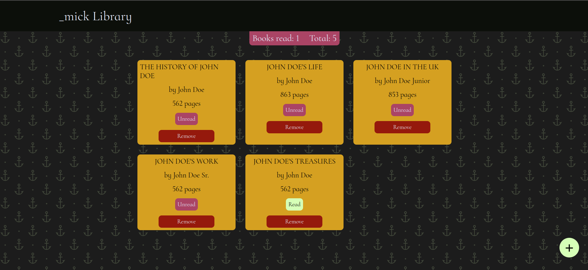
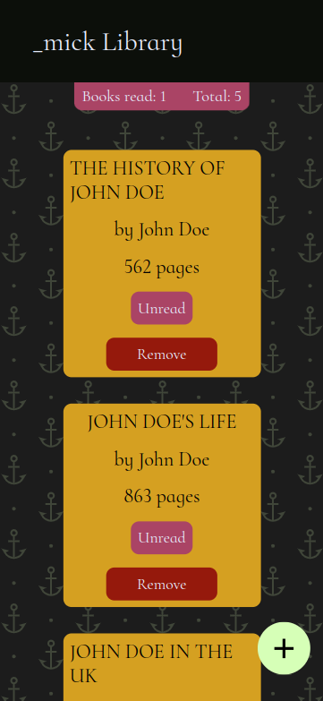

# Mick Library

This is a library project part of [The Odin Project](https://www.theodinproject.com)

## Features

1. It stores books on tiles displayed on the page.
2. You can add books by pressing the add button at the bottom right corner.
3. The add button brings up a form for adding a book.
4. The books are stored as objects(Book) in a simple array in Javascript.
5. Read books and total books counts are shown at the top below the heading of the page.

## Demo

    The live project can be viewed [here](https://mickfrog.github.io/library)

## Preview

- Desktop Preview
  

- Mobile Preview
  

## Built With

- HTML
- CSS
- Javascript

[MickFrog](https://www.github.com/MickFrog)
